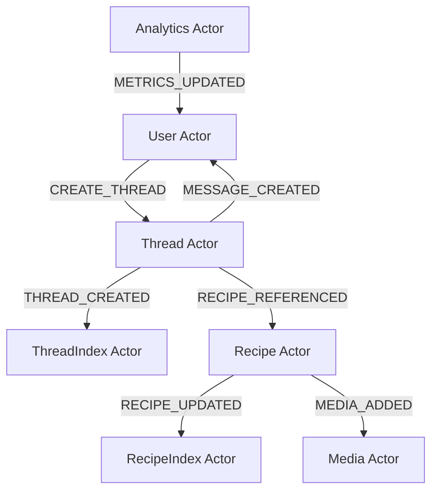

I'll help you think through reorganizing the application around actors (Durable Objects) that can communicate with each other via events. Here's a suggested actor-based architecture:

```markdown
# Application Actors

## Core Actors

### User Actor
- Manages user state and preferences
- Subscribes to Threads they participate in
- Subscribes to Recipes they've created/saved
- Handles user-specific analytics
- Can send events:
  - CREATE_THREAD
  - JOIN_THREAD
  - CREATE_RECIPE
  - SAVE_RECIPE

### Thread Actor
- Manages conversation state
- Handles message ordering and delivery
- Maintains WebSocket connections with participants
- Can send events:
  - MESSAGE_CREATED
  - RECIPE_REFERENCED
  - INTENT_DETECTED
  - PARTICIPANT_JOINED
  - PARTICIPANT_LEFT

### Recipe Actor
- Manages recipe versions
- Handles recipe metadata
- Tracks recipe usage/popularity
- Can send events:
  - VERSION_CREATED
  - RECIPE_UPDATED
  - RECIPE_USED
  - MEDIA_ADDED

### Media Actor
- Manages media assets
- Handles transcoding/optimization
- Tracks media usage
- Can send events:
  - MEDIA_UPLOADED
  - MEDIA_PROCESSED
  - MEDIA_REFERENCED

## Index Actors (for search/filtering)

### RecipeIndex Actor
- Maintains searchable index of recipes
- Subscribes to Recipe events
- Handles recipe search queries
- Can send events:
  - INDEX_UPDATED
  - SEARCH_RESULTS

### ThreadIndex Actor
- Maintains searchable index of threads
- Subscribes to Thread events
- Handles thread search queries
- Can send events:
  - INDEX_UPDATED
  - SEARCH_RESULTS

### Analytics Actor
- Subscribes to events from all actors
- Aggregates usage statistics
- Generates reports
- Can send events:
  - METRICS_UPDATED
  - TREND_DETECTED

## Event Flow Example



### Key Benefits
1. Each actor maintains its own state
2. Loose coupling through event-based communication
3. Natural scaling as each DO runs independently
4. Clear boundaries of responsibility
5. Easy to add new features by creating new actors
6. Built-in resilience through message passing

### Implementation Notes
- Each actor should have its own SQLite database for state
- Use WebSocket connections for real-time updates
- Implement retry logic for inter-actor communication
- Consider using a message queue pattern for reliability
- Use versioning for event schemas
```

This architecture allows for better scalability and maintainability compared to a traditional route-based approach. Each actor can evolve independently, and new features can be added by creating new actors or extending existing ones through event subscriptions.

Would you like me to elaborate on any particular aspect of this architecture?